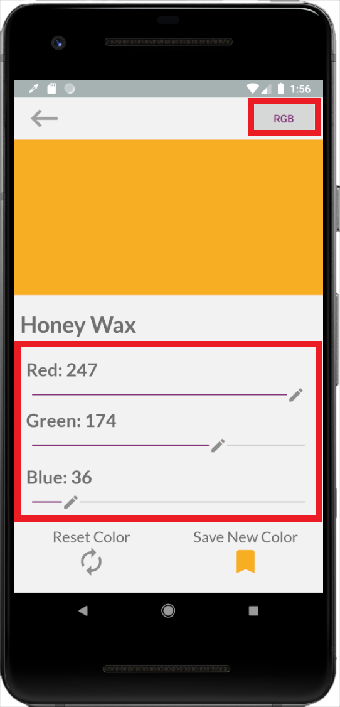
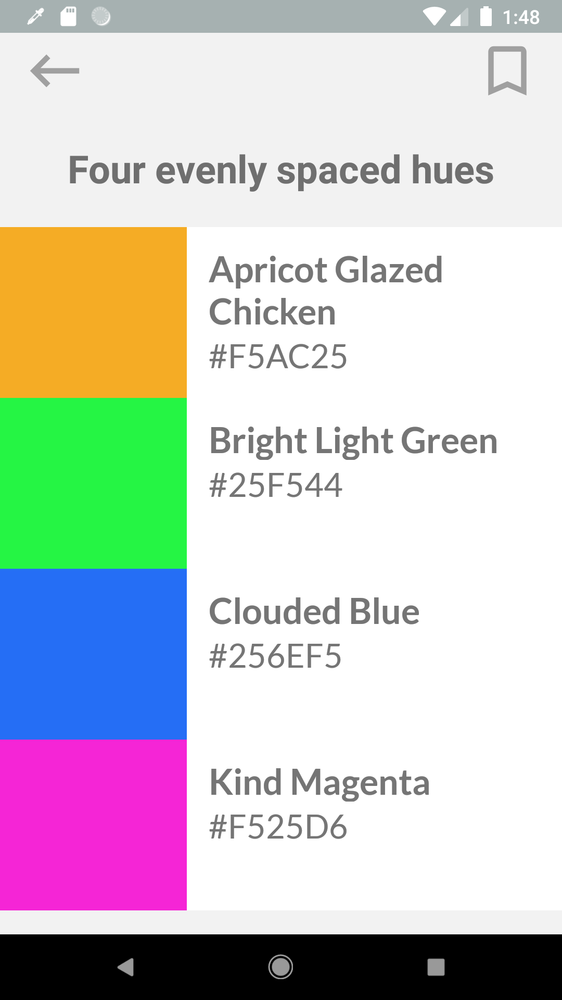
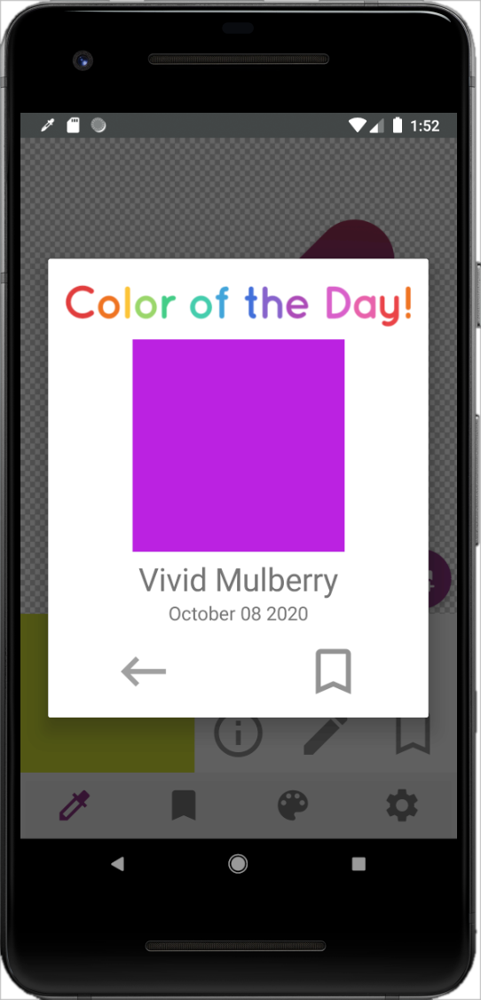
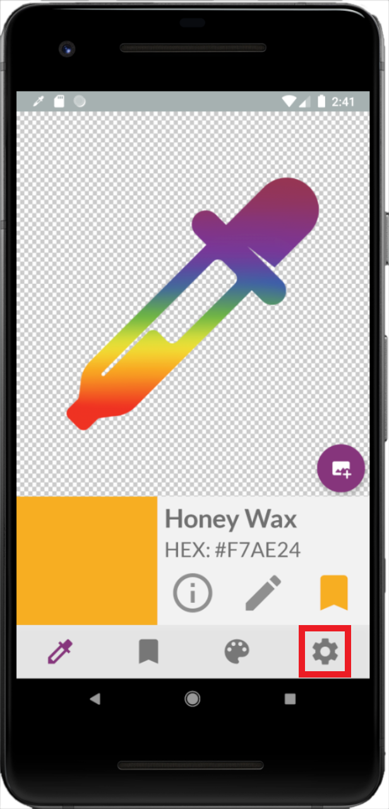
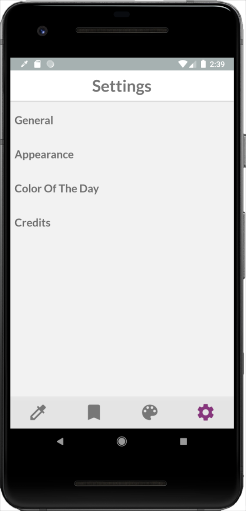
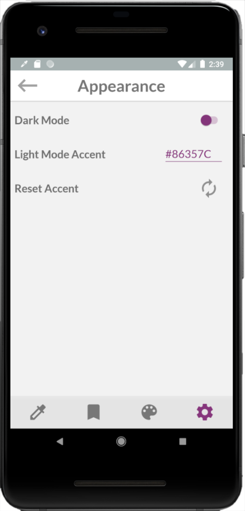

<h2 style="margin: auto;">About</h2>
---
Looking for a convenient color-picking experience on the go? Look no further than LiveColor. All it takes to get started is simply uploading a photo from your mobile device’s camera roll. From there you’ll be able to save colors directly from your own photos! Save your favorite colors, design your own palettes, generate complex harmonies, and even edit colors all within LiveColor.  

<h2 style="margin: auto;">Features</h2>
---

### Color Picking

  
  
  
  
Begin by clicking the Add Image button. Then either take a photo with your device or upload a photo from your photo gallery.

  
After selecting the desired color by tapping the image, press the Save Color button to save the color.

  
Then click the Saved Colors icon on the bottom bar in order to see all the colors you have saved.

  

    <a id="link1CP" onclick="onStep1CP()" class="activeCP">1</a>
    <a id="link2CP" onclick="onStep2CP()">2</a>
    <a id="link3CP" onclick="onStep3CP()">3</a>
  

---

### Color Info & Editing

  
   <!--uses the same image so I'm resuing it to save space-->
   
   
  
To view the color info for the currently selected color, click on the Info icon in the color description. To see color info for       colors you have already saved, go to your Saved Colors.

  
Once in your Saved Colors simply tap on a color to view its Color Info.

  
From here you can view and edit your colors in HEX, RGB, and HSV. To edit a color, tap the pencil icon in the top right.

  
Modify your color in RGB or HSV with live comparison to the original color.

  

    <a id="link1CI" onclick="onStep1CI()" class="activeCI">1</a>
    <a id="link2CI" onclick="onStep2CI()">2</a>
    <a id="link3CI" onclick="onStep3CI()">3</a>
    <a id="link4CI" onclick="onStep4CI()">4</a>
  

---

### Generating Harmonies

  
  
  
  
Navigate to the Color Info of your desired color. Once there tap the  "VIEW COLOR HARMONIES" button on the bottom.

  
Scroll through our many automatically generated harmonies. If you find one you like, simply tap on it to display all the colors       in the harmony.

  
From here, you can look at the info for any of the colors in the palette as you would for any other color! If you like the           palette and want to save it, you can hit the save button in the top right corner and set a name for your new palette.

  

    <a id="link1CH" onclick="onStep1CH()" class="activeCH">1</a>
    <a id="link2CH" onclick="onStep2CH()">2</a>
    <a id="link3CH" onclick="onStep3CH()">3</a>
  

---

### Color of the Day

Discover and appreciate a different color every day with our Color of The Day feature! You might even get a special color for certain holidays!

---

### Customization & Settings

  
  
  
  
To access Settings for the LiveColor app click the cog icon on the bottom right.

  
Tweak any of our app settings to match your preferences. Check out the "Appearance" settings page to try out Dark Mode.

  
From here Enable or Disable Dark Mode for the app. Type or paste in a hex value for the accent color for the current mode: Dark        or Light.

  

  <a id="link1CS" onclick="onStep1CS()" class="activeCS">1</a>
  <a id="link2CS" onclick="onStep2CS()">2</a>
  <a id="link3CS" onclick="onStep3CS()">3</a>
  

---

## About Us
<a href="./credits.html">Meet the Team!</a>

