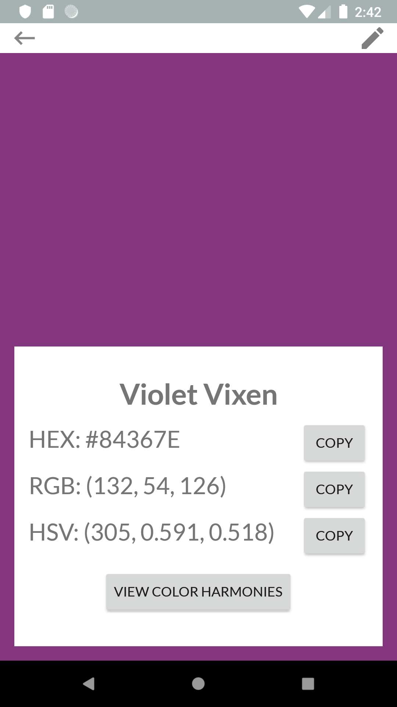
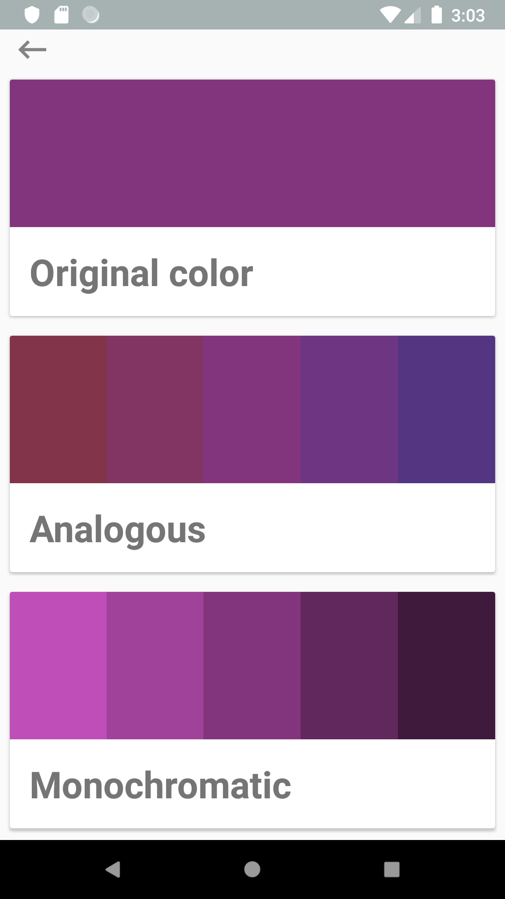

<h2 style="margin: auto;">About</h2>

Looking for a convenient color-picking experience on the go? Look no further than LiveColor. All it takes to get started is simply uploading a photo from your mobile device’s camera roll. From there you’ll be able to save colors directly from your own photos! Save your favorite colors, design your own palettes, generate complex harmonies, and even edit colors all within LiveColor.  

<h2 style="margin: auto;">Features</h2>

### Color Picking

  

  <a onclick="onStep1()" class="active">1</a>
  <a onclick="onStep2()">2</a>
  <a onclick="onStep3()">3</a>
  

---

### Color Info

---

### Harmonies

---

### Installation

- Download **[Android Studio](https://developer.android.com/studio)**
- Set up GitHub through Android Studio’s VCS options
- Download the project
- Using Android Studio’s AVD manager, set up and run an emulator using Pixel 2 API 27

## About Us
<a href="./credits.html">Meet the Team!</a>

