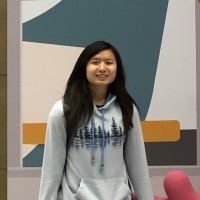

<!-- Add icon library -->
<link rel="stylesheet" href="https://cdnjs.cloudflare.com/ajax/libs/font-awesome/4.7.0/css/font-awesome.min.css">
<h1 class="title">Team Members</h1>

  

    

      
      

        <a href="https://www.linkedin.com/in/paige-riola/" class="icon" title="LinkedIn Profile">
          <i class="fa fa-linkedin"></i>
        </a>
      

    

  

  

    <h2>Paige Riola</h2>
    
I love AI and automation, so naturally I chose to help with UI on a
                                color picking app. I very much enjoy developing with friends, even
                                if it's outside of my comfort zone. My favorite color in the app is
                                called "Jedi Night" a deep dark green.

  

  

    

      
      

        <a href="https://www.linkedin.com/in/gabriella-lindsey-8493951b0/" class="icon" title="LinkedIn Profile">
          <i class="fa fa-linkedin"></i>
        </a>
      

    

  

  

    <h2>Gabriella Lindsey</h2>
    
I love AI and automation, so naturally I chose to help with UI on a
                                color picking app. I very much enjoy developing with friends, even
                                if it's outside of my comfort zone. My favorite color in the app is
                                called "Jedi Night" a deep dark green.

  

  

    

      
      

        <a href="https://www.linkedin.com/in/dustin-s-7938a394/" class="icon" title="LinkedIn Profile">
          <i class="fa fa-linkedin"></i>
        </a>
      

    

  

  

    <h2>Dustin Seltz</h2>
    
I love AI and automation, so naturally I chose to help with UI on a
                                color picking app. I very much enjoy developing with friends, even
                                if it's outside of my comfort zone. My favorite color in the app is
                                called "Jedi Night" a deep dark green.

  

  

    

      
      

        <a href="https://www.linkedin.com/in/daniel-luft-martinez/" class="icon" title="LinkedIn Profile">
          <i class="fa fa-linkedin"></i>
        </a>
      

    

  

  

    <h2>Daniel Luft-Martinez</h2>
    
I love AI and automation, so naturally I chose to help with UI on a
                                color picking app. I very much enjoy developing with friends, even
                                if it's outside of my comfort zone. My favorite color in the app is
                                called "Jedi Night" a deep dark green.

  

  

    

      
      

        <a href="https://www.linkedin.com/in/shealtiel-mulder-6329641b0/" class="icon" title="LinkedIn Profile">
          <i class="fa fa-linkedin"></i>
        </a>
      

    

  

  

    <h2>Shealtiel Mulder</h2>
    
I enjoy creating beautiful UI experiences and using programming to
                                solve unique problems. I am very grateful for the opportunity to work
                                on this project alongside my colleagues and friends. My favourite color
                                in the app is called "Aggressive Baby Blue", what a silly name!

  

  

    

      
      

        <a href="https://www.linkedin.com/in/mwong775/" class="icon" title="LinkedIn Profile">
          <i class="fa fa-linkedin"></i>
        </a>
      

    

  

  

    <h2>Melanie Wong</h2>
    
I love AI and automation, so naturally I chose to help with UI on a
                                color picking app. I very much enjoy developing with friends, even
                                if it's outside of my comfort zone. My favorite color in the app is
                                called "Jedi Night" a deep dark green.

  

  

    

      
      

        <a href="https://www.linkedin.com/in/andrewtgg/" class="icon" title="LinkedIn Profile">
          <i class="fa fa-linkedin"></i>
        </a>
      

    

  

  

    <h2>Andrew Tran</h2>
    
I love AI and automation, so naturally I chose to help with UI on a
                                color picking app. I very much enjoy developing with friends, even
                                if it's outside of my comfort zone. My favorite color in the app is
                                called "Jedi Night" a deep dark green.

  

